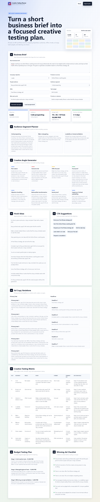

# Meta Ads Creative Testing Planner

A professional frontend portfolio project that turns a short business brief into a structured Meta Ads creative testing plan.

Live Demo: https://fazilprojects.github.io/meta-ads-creative-testing-planner/

## Screenshot



## Project Purpose

This project was built by Fazil Waseem as a Meta Ads and performance marketing portfolio project.

The goal is to show practical understanding of Meta Ads creative testing workflows, including audience segments, creative angles, hooks, ad copy variations, testing matrix planning, budget testing, and winning ad criteria.

This is not a real Meta Ads platform and does not connect to Meta Ads, APIs, ad accounts, or live campaign data. It is a local JavaScript-based creative testing planner.

## What It Does

The user enters a short business brief, campaign objective, product or service, target audience, offer, main pain point, promise or outcome, and test budget.

The dashboard then generates a complete creative testing plan.

The generated plan includes:

- Audience segment planner
- Creative angle generator
- Hook ideas
- CTA suggestions
- Primary text variations
- Headline variations
- Creative testing matrix
- Budget testing plan
- Winning ad checklist
- Exportable creative test plan

## Key Features

- Short brief to creative test plan workflow
- Campaign objective selector
- Audience segment planner
- Offer and pain point inputs
- 8 creative angle suggestions
- 10+ hook ideas
- 5 primary text variations
- 7 headline variations
- CTA suggestions
- 8-row creative testing matrix
- Budget testing plan with 70/20/10 split
- Winning ad checklist
- Export plan feature
- Reset functionality
- Premium animated dashboard UI
- Responsive mobile-friendly layout
- No external APIs
- No external frameworks

## Test Example

Example campaign used for testing:

**Business:** FitLife Coaching  
**Campaign objective:** Leads  
**Product/service:** Online fitness coaching plan  
**Target audience:** Busy professionals, age 25–40  
**Audience segment:** Cold prospecting  
**Offer:** Free fitness strategy call  
**Pain point:** No time to plan workouts or stay consistent  
**Promise/outcome:** Build a simple weekly fitness routine that fits a busy schedule  
**Test budget:** PKR 50,000  

The dashboard generated creative angles, hooks, ad copy variations, a Meta Ads testing matrix, budget split, and a winning ad checklist.

## Tech Stack

- HTML
- CSS
- JavaScript
- GitHub Pages

## Folder Structure

```text
.
├── index.html
├── style.css
├── script.js
├── README.md
├── AGENTS.md
└── docs/
    ├── PROJECT_BRIEF.md
    ├── DESIGN_SYSTEM.md
    └── CONTENT.md
